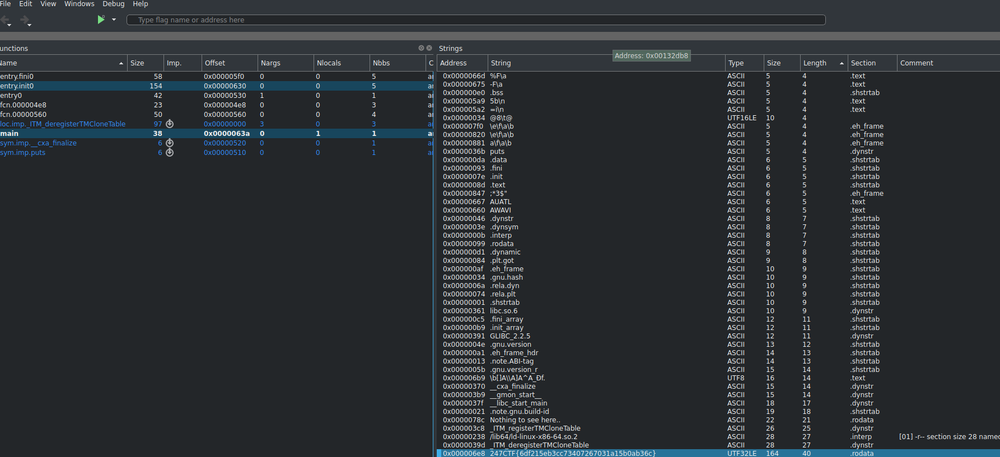

# CTF Name – the more the merrier


## Description
https://247ctf.com/dashboard#collapse-c9


## Solution
```bash

$ file the_more_the_merrier

the_more_the_merrier: ELF 64-bit LSB shared object, x86-64, version 1 (SYSV), dynamically linked, interpreter /lib64/ld-linux-x86-64.so.2, for GNU/Linux 3.2.0, BuildID[sha1]=0f750d638337391328fa7432dd362189de908c1e, stripped
```
Opening a binary in `Cutter` gave me the :


## Flag
```
247CTF{6df215eb3cc73407267031a15b0ab36c}
```

### Authors
* **Lukasz** - [luk6xff](https://github.com/luk6xff)

### License
[MIT](https://choosealicense.com/licenses/mit/)